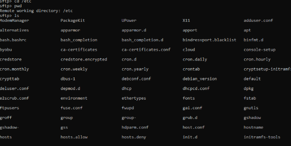
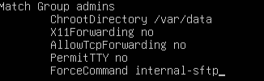
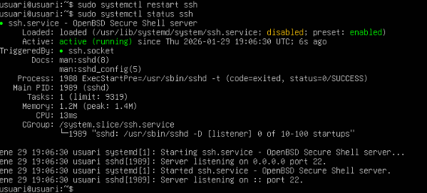
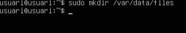
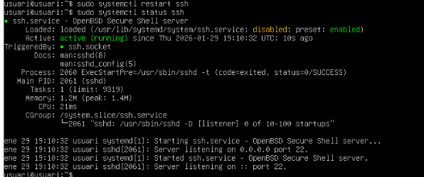
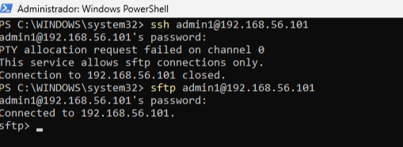

# ACTIVITAT B

Primer fem un sudo apt install openssh-server -y posem la nostra contrasenya i veiem com ens comença a llegir tot. 

Entrem a la màquina client i posem sftp usuari@192.168.56.101 cadascú amb la seva ip corresponent, posem la contrasenya i ja podem començar a treballar. 

posem un interrogan i podem veure el available command. 

Aqui podem veure com l’usuari pot explorar tot el sistema d’arxius.

Entrem al arxiu de ssh config 

I abaix de tot de l’arxiu afegim aquest paràgraf. 

surtim de l’arxiu i fem un restart ssh i status ssh 

Fem un sudo addgroup admins i dins de admins afegim amb useradd admin1 i li posem una contrasenya

Fem un sudo mkdir /var/data i amb ls -l /var podem veure al que hi ha a la carpeta.

Fem sudo mkdir /var/data/files

fem un sudo chown :admins /var/data/files i un sudo chown 2770 /var/data/files fem un ls -l /var/data per veure que s’ha fet correctament. 

fem un restart i un status ssh

Entrem amb powershell del client i posem sftp admin1@192.168.56.101 
posem la contrasenya i veiem com funciona correctament.

