## T03: Serveis de transferència de fitxers

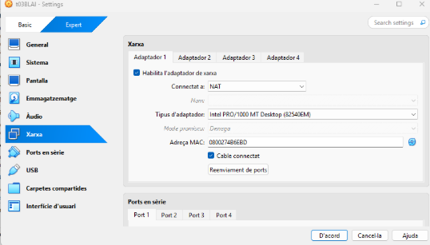

Posem el primer adaptador en xarxa NAT

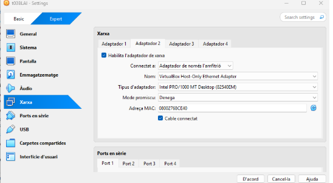

I al segon adaptador el posem en xarxa amfitrió

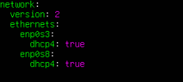

Entrem a configurar la xarxa amb el nano /etc/netplan/50-cloud-init.yaml. activem l’enp0s8 i posem al dhcp4: true

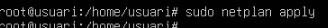

Sortim i fem un sudo netplan apply.

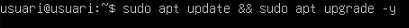

Fem un sudo apt update && sudo apt upgrade -y. 

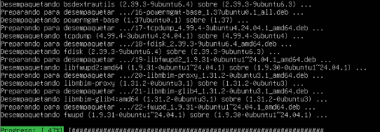

I podem veure com llegeix els paquets de la màquina 

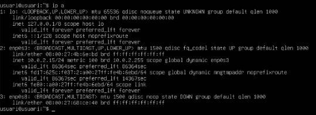

Un cop entrem a la màquina un cop posats els adaptadors correctament fem un ip a per veure les nostres ip’s de la màquina.

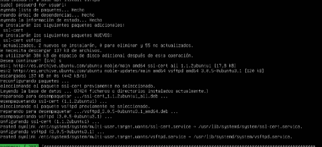

amb la comanda sudo apt install vfstpd per instalar el vfstpd.

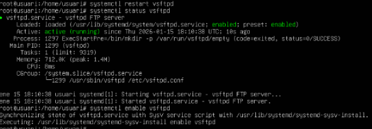

Un cop instalat fem un 
systemctl status vsftpd 
i un systemctl enable vsftpd

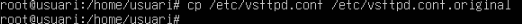

Fem un cp /etc/vsftpd.conf /etc/vsftpd.conf.original

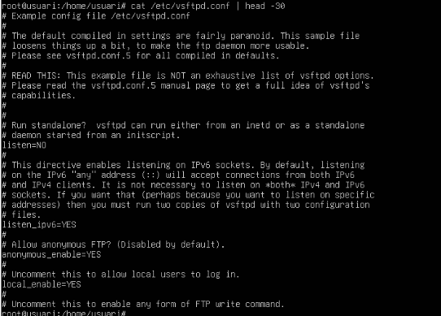

i fem un cp /etc/vsftpd.conf /etc/vsftpd.bak

Fem un cat /etc/vsftpd.conf | head -30 per revisa el contigut del fitxer de configuració. 

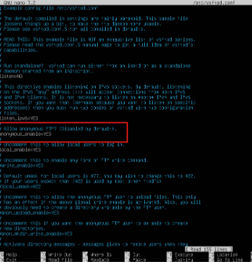

Amb la comanda sudo nano /etc/vfstpd.conf entrem al arxiu. 

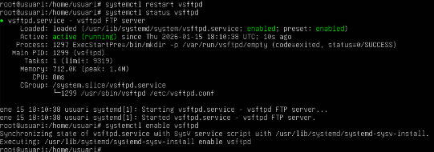

Un cop entrem al arxiu busquem anonymous_enable=No i ho cambien per YES i reiniciem el servei. 

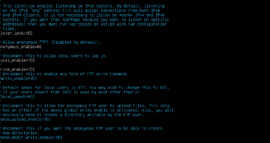
Per reinicia el servei fem un: 
systemctl restart vsftpd 
systemctl status vsftpd
systemctl enable vsftpd 
I ja haurem reiniciat el servei de l’arxiu. 

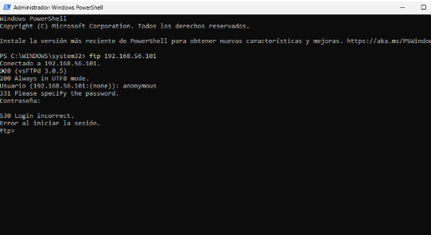

I quan a l’arxiu posem que no li estem dien que l’usuari anonymous no pugui entrar. 

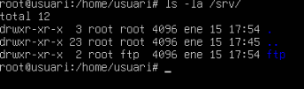

Com podeu veure quan el posem no li deixa entrar. 

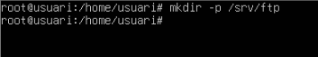

Farem un ls -la /srv/ per veure que estan a dins correctament. 

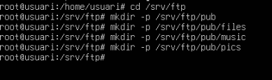

fem un mkdir per crear la carpeta /srv/ftp

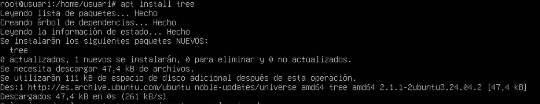

I fem mkdir perque a dins de la carpeta /srv/ftp i hagi al pub el files al music i el pics

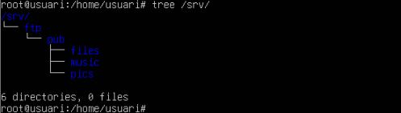

Installem al tree amb la comanda apt install tree

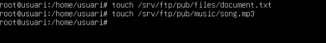

I un cop instal·lat fem la comanda tree /srv/ per veure al que te a dins la carpeta /srv/

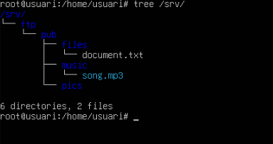

Fem un touch document.txt i un touch song.mp3

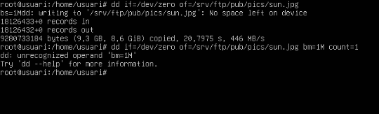

I si tornem a fer el tree /srv/ podem veure com a dins de files esta el document.txt i dins del music està al song.mp3

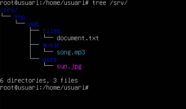

i creem el sun.jpg dins de la carpeta /srv/ftp/pub/pics/sun.jpg

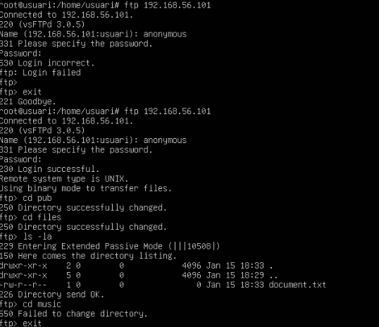

i si fem un altre tree /srv/ podem veure que a dins de pics esta al sun.jpg

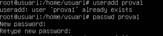

Fem un ftp amb la nostre ip posem anonymous posem la conttrasenya i podem veure que a l’anonymous li deixa entrar. 

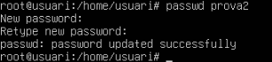

creem la prova1 amb useradd prova1 i amb passwd creem la contrasenya i al mateix amb la prova2

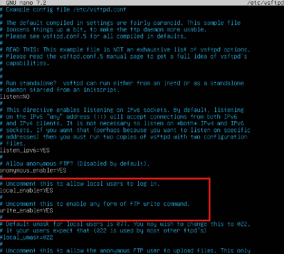

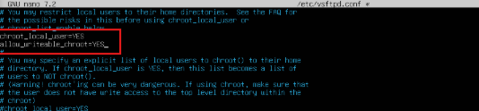

Entrem a l’arxiu sudo nano /etc/vsftpd busquem la linia marcada en vermell i las posem en YES

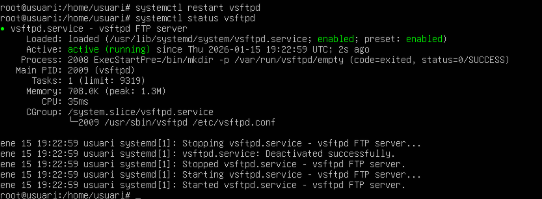

I mes abaix de l’arxiu busquem aquestas dues i las posem tambe en YES

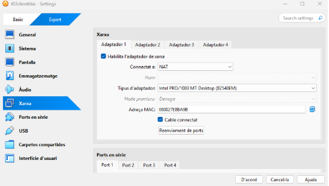

sortim de l’arxiu i fem un restart de l’arxiu i un status per veure com està al servei.

## CLIENT 

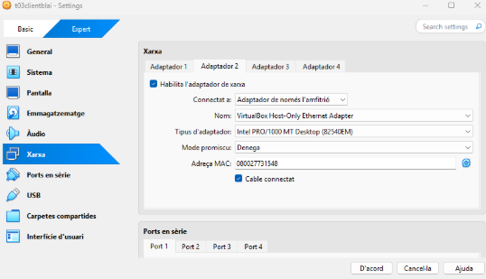

Posem el primer adaptador en NAT 

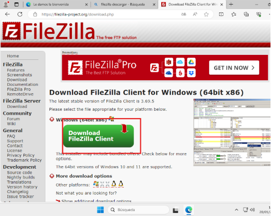

I el segon al posem habilitat amb amfitrió.

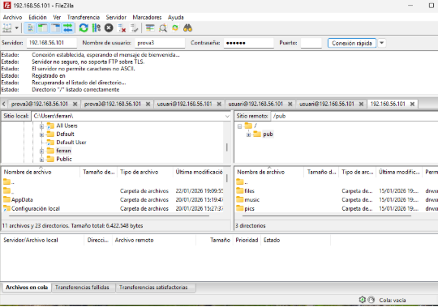

I posan la nostre ip de la màquina del servido amb al nom del usuari creat al servidor i la seva contrasenya ens haurien de sortir totes las carpetes creades al servidor correctament. 
