## T04: Instal·lació Windows Server 2025

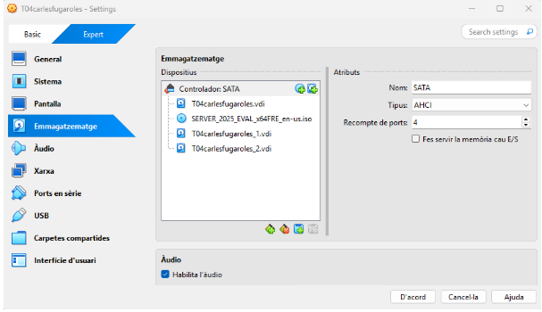 

Primer creem dos discos un de 32GB i un de 10GB. 

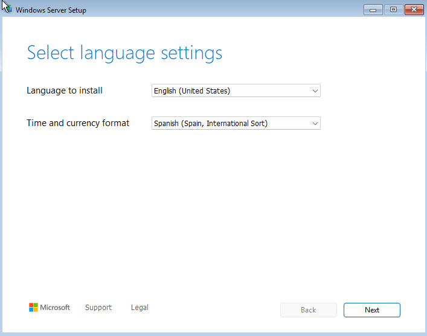 

Posem anglès com a llenguatge i spain international en el select language. 

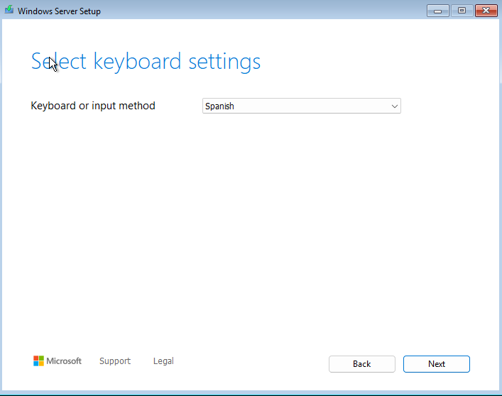 

I posem spain en el idioma del teclat. 

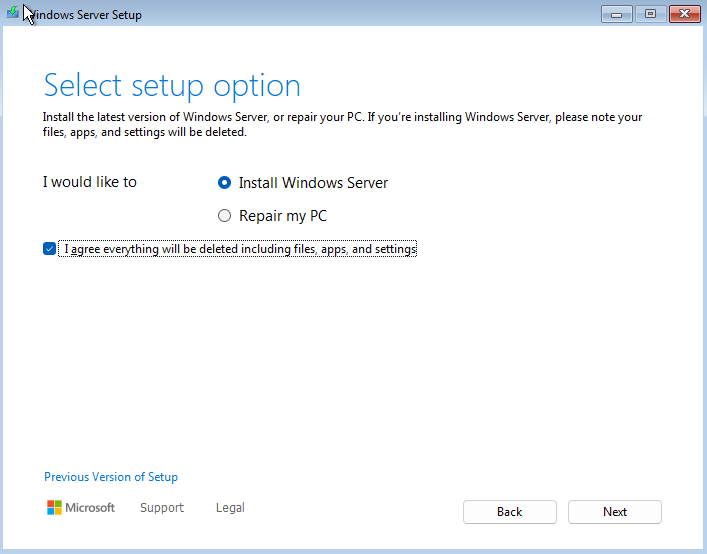 

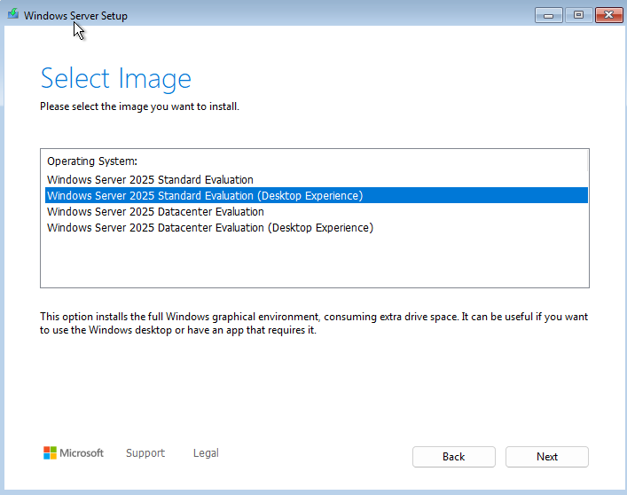 

I seleccionem la segona opció de tots els windows. 

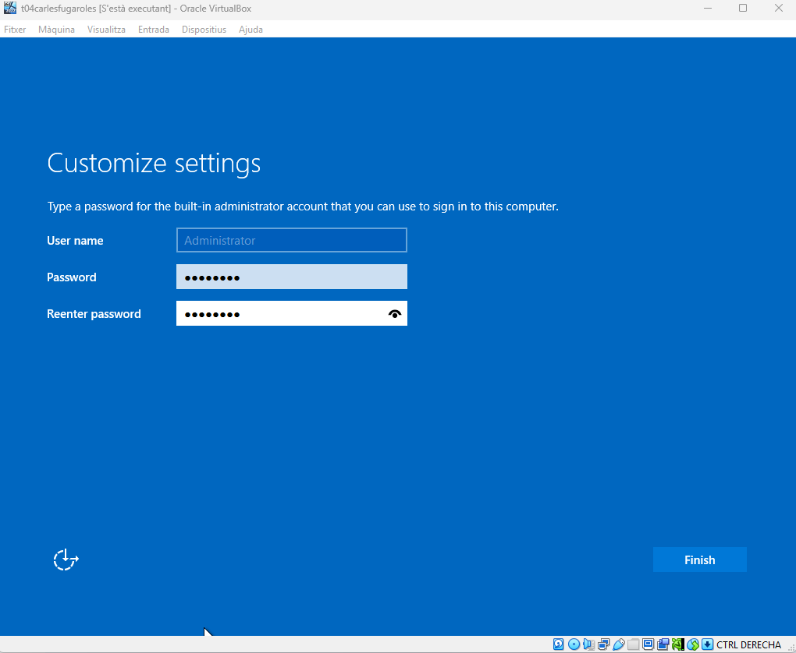 

Posem la contrasenya que serà P@ssw0rd per tothom

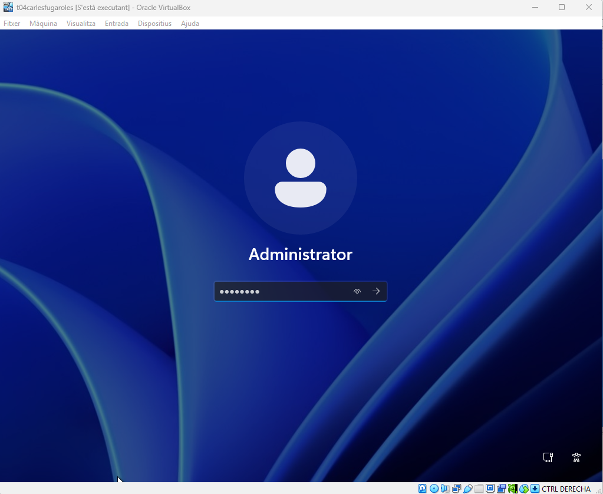 

Per entrar com a administrador li hem de donar a la part de adalt a Entrada a teclat i a la tercera opcio i entrem com a administrador amb la contrasenya posada anteriorment. 

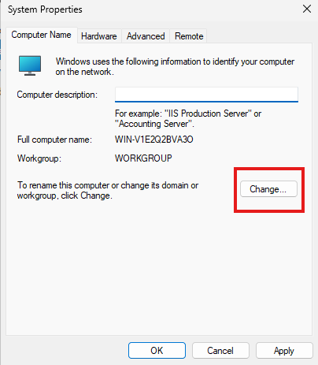 

Entrem per cambiar el nom i li donem a change per canviar-lo. 

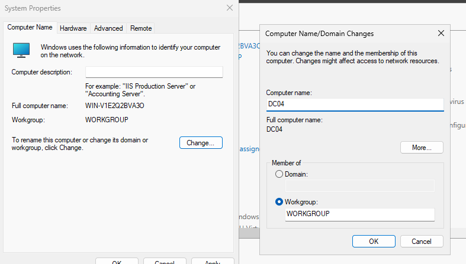 

Un cop li donem a change cambiem el nostre nom en el meu cas es DC04.

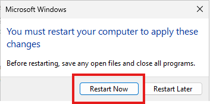 

Un com fem el canvi de nom la propia màquina ens dona l’opció de reiniciar. 

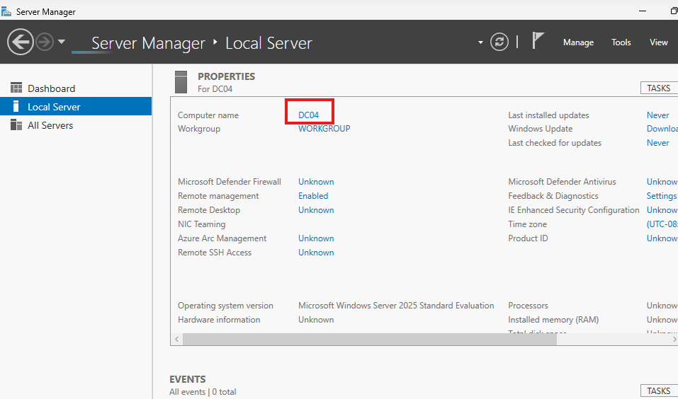 

Com podeu veure ja ens hem cambiat el nom. 

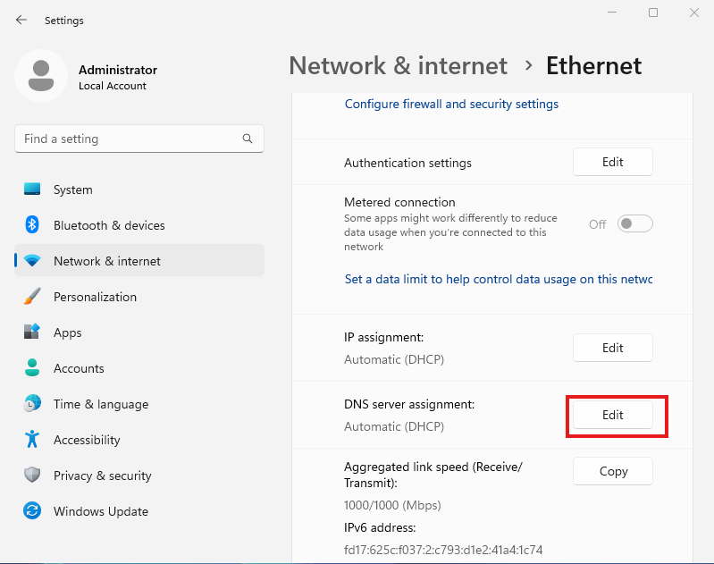 

Entrem a ajustes a l’apartat de network & internet i on posa DNS server assigment l’editem.

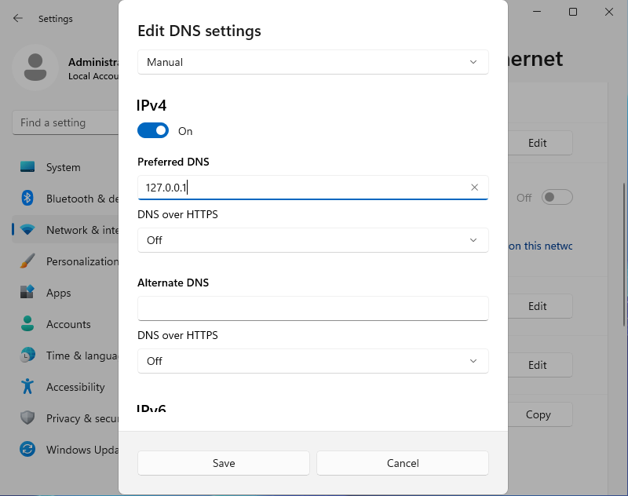 

La posem manual activem l’ipv4 i posem 127.0.0.1 que es la nostre i fem save

