## T05: Instal·lació del domini

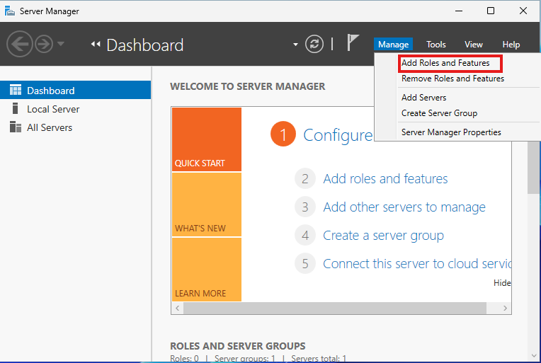

Tornem a entrar al server manager i adalt a la dreta anem a manage i la primera opcio. 

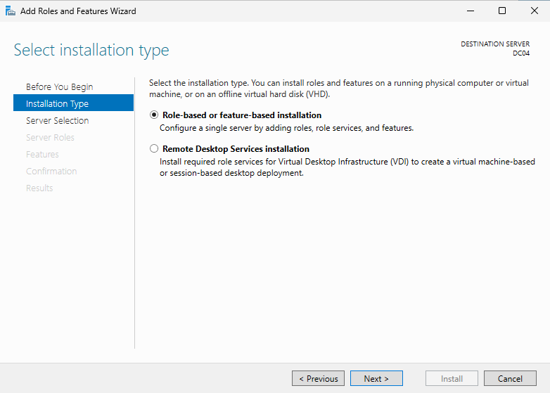

Anem a installation type i deixem activada la primera opció.

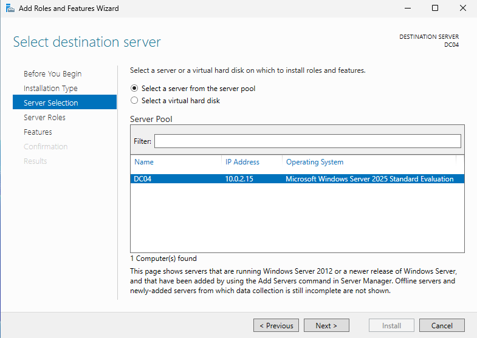

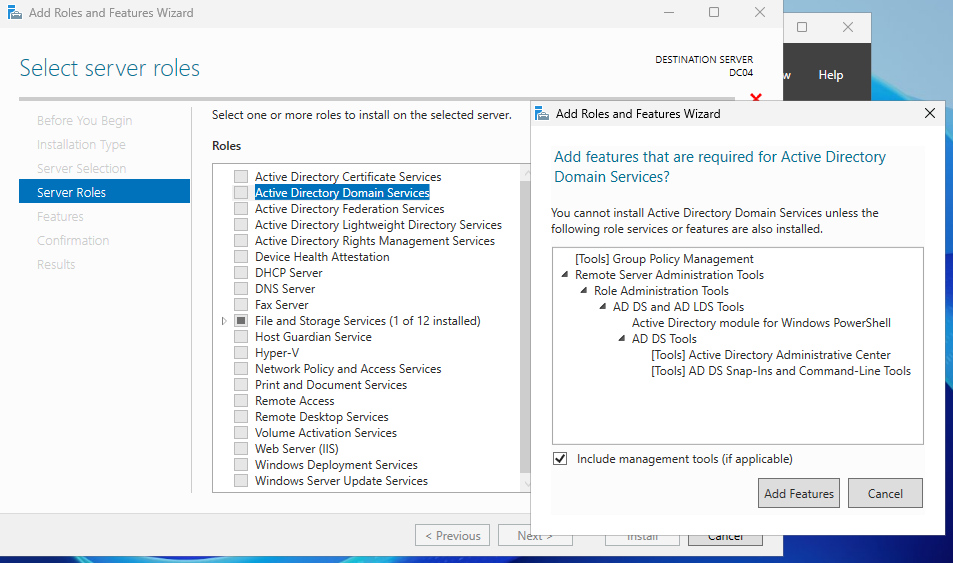

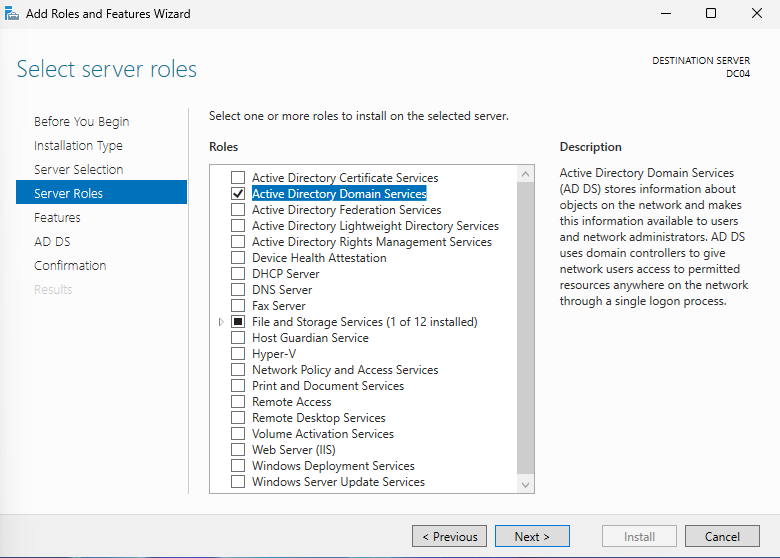

Com podeu veure ja s’ha activat la opcio.

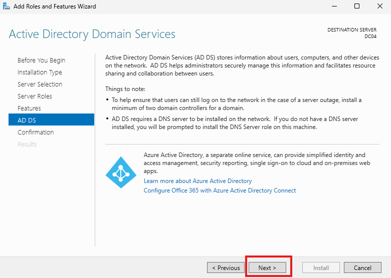

Li donem next.

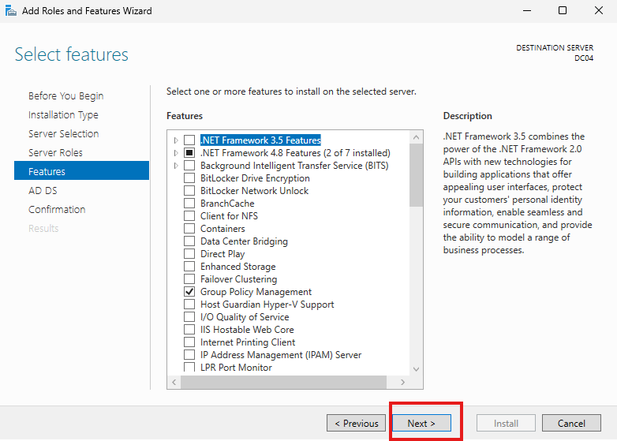

Anem a features i tambe fem next sense tocar res. 

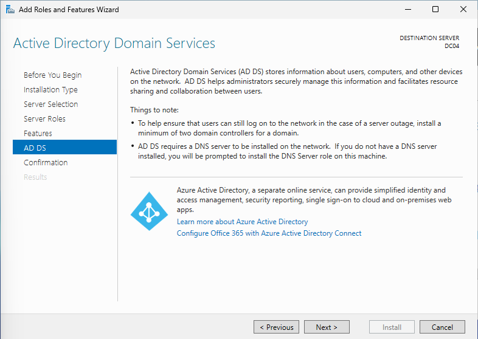

i a AD DS tambe li donem next sense cambiar res.

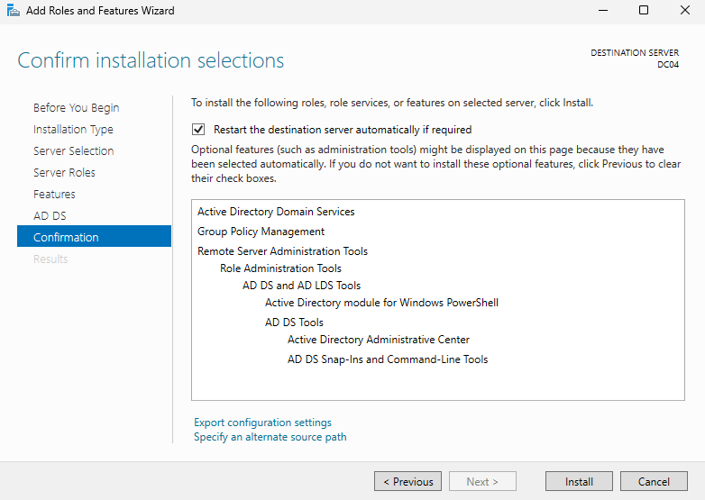

Activem la opcio que es per restaurar.

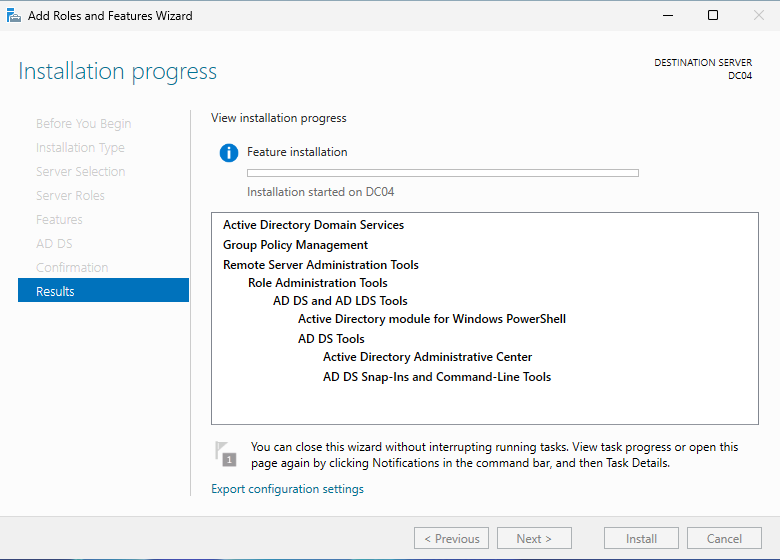

I esperem a que s’ens instal·li al feature.

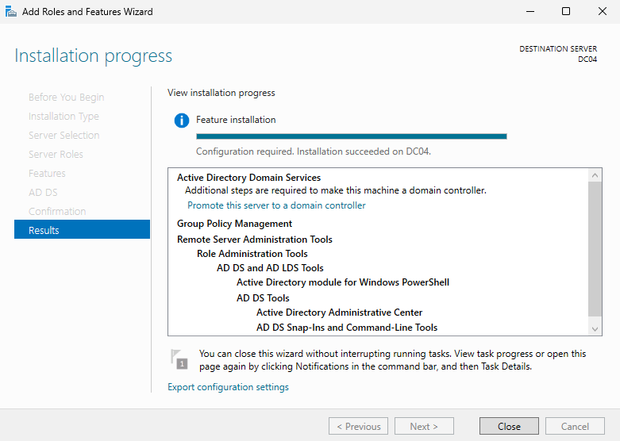

Quan ja esta la instal·lació tanquem la aplicació. 

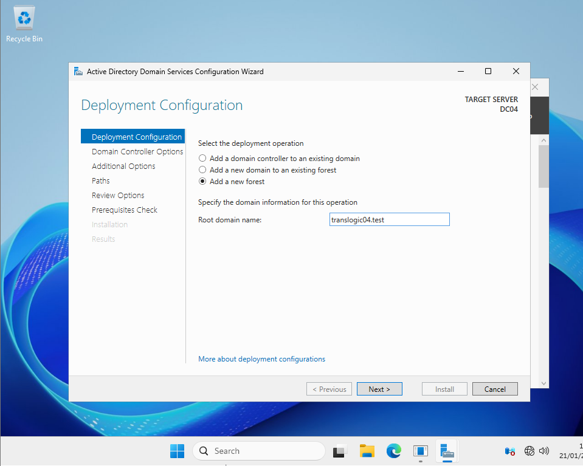

En el root domain name hem de posar el nom de translogic04.test cadascu amb el seu numero de llista. 

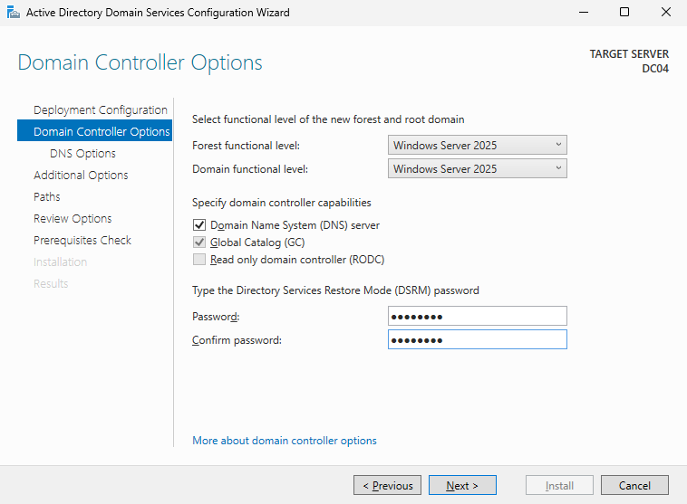

Despres hem de posar la contrasenya P@assw0rd la repetim per confirma-la i li donem next.

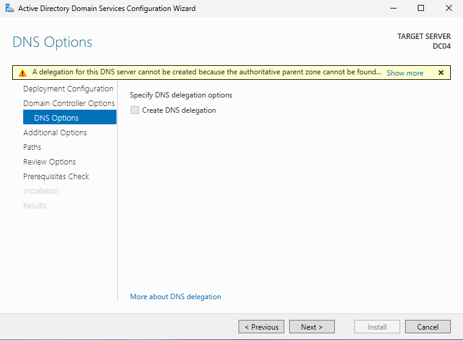

Aqui directament no toquem res fem next. 

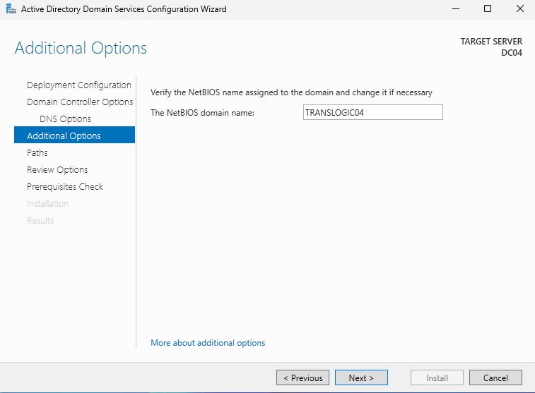

S’ens posara el nom que hem posat anteriorment com a domini. Fem next. 

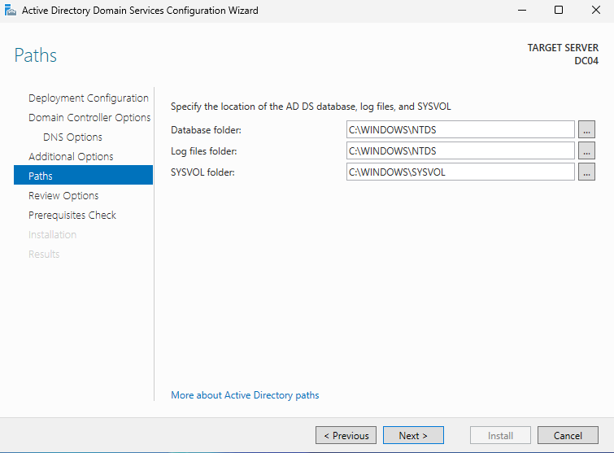

Aqui ho deixem tal qual està. 

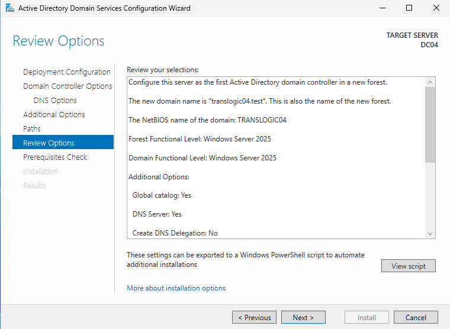

I li donem a view script un cop aqui s’ens obrira l’escrip i ens l’hem de passar al gmail desde la màquina virtual. 

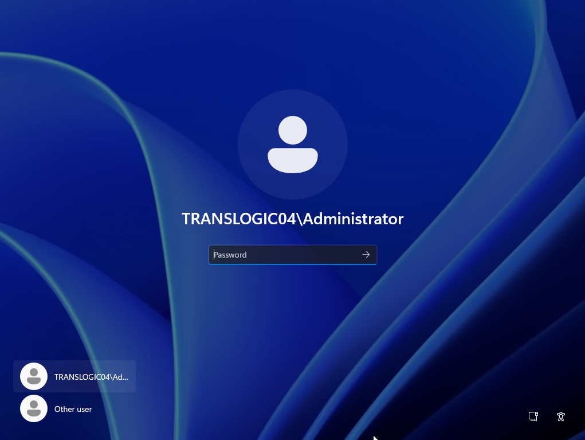

Un cop copiat l’escrip hem de reiniciar la màquina per tornar a tenir conexió i veurem com s’ha cambiat el domini el nom posat anteriorment. 

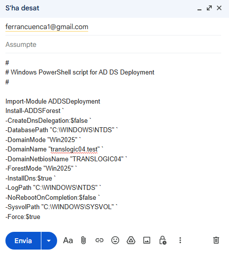

Ens passem l’escript de la màquina virtual a la máquina física desde el gmail mateix. 

