### T06

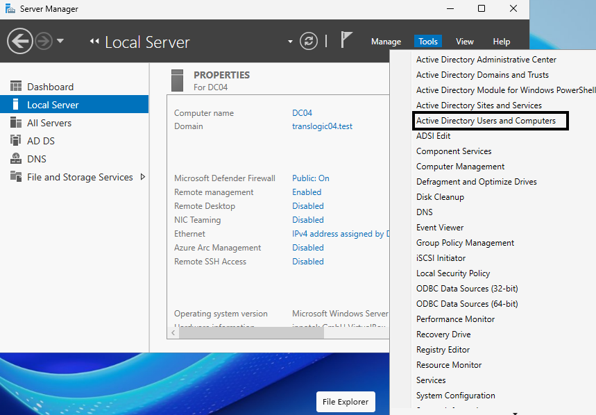

Entrem al server manager i adalt a la dreta viem opcions, li donem a tools i a la opció que esta en negra a la captura

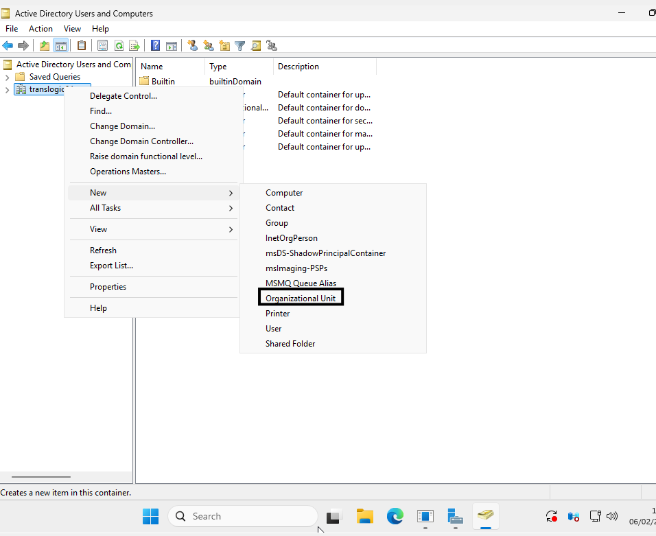

Un cop a dintre a dins de translogic fem click dret “new” i organizational Unit 

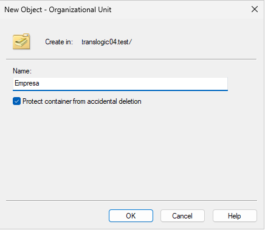

Creem Empresa.

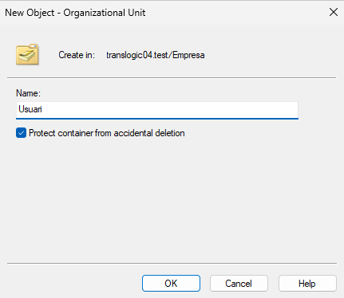

Fem al mateix procediment i creem usuari 

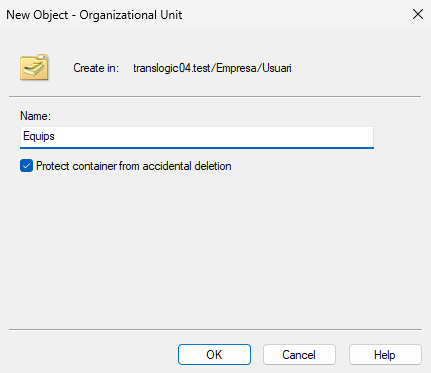

Creem equips

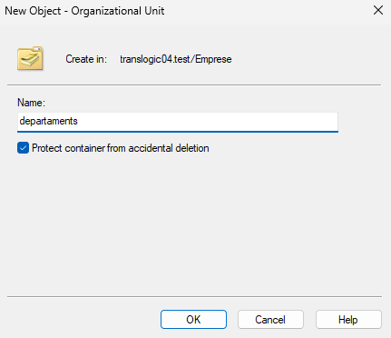

I creem departament 

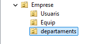

I podem vuere com a dins de empresa em creat els usuaris, equips i departaments 

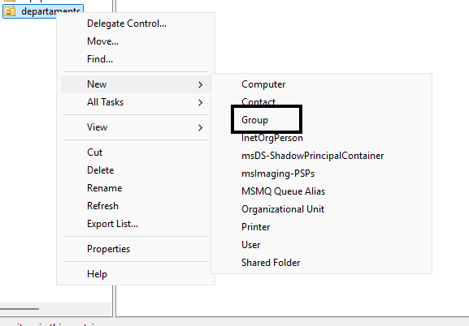

Ara a dins de departaments fem click dret “new” i Group.

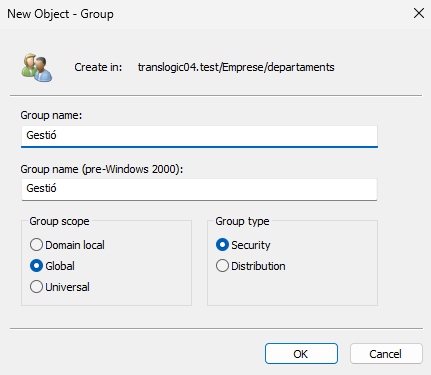

I al nom de grup serà Gestió que ha de estar en Global.

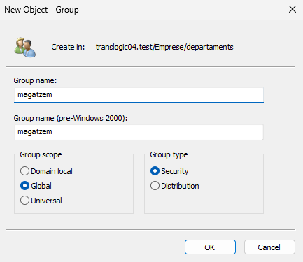

magatzem que tambe ha d’estar la opció de global.

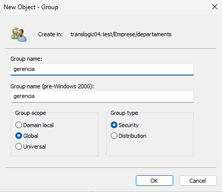

gerencia la creem igual amb global tambe. 

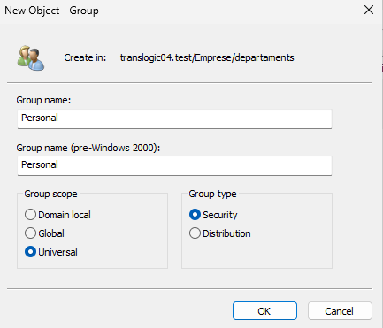

i personal la creem pero activan la opció universal enves de global. 

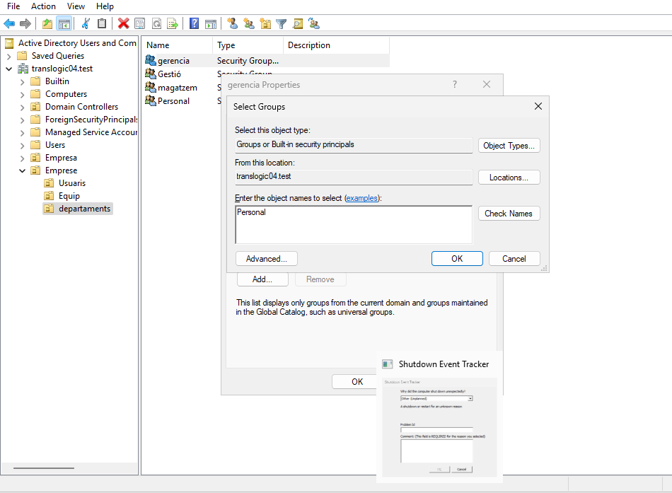

Dins de departaments seleccionem grups i al nom seleccionat posarem personal a dins de cada grup. 

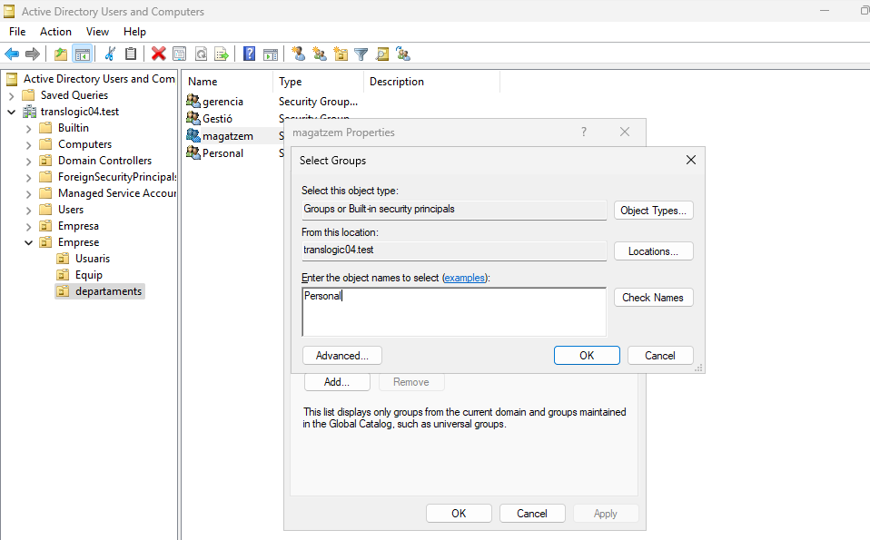

En el grup de magatzem posem personal tambe 

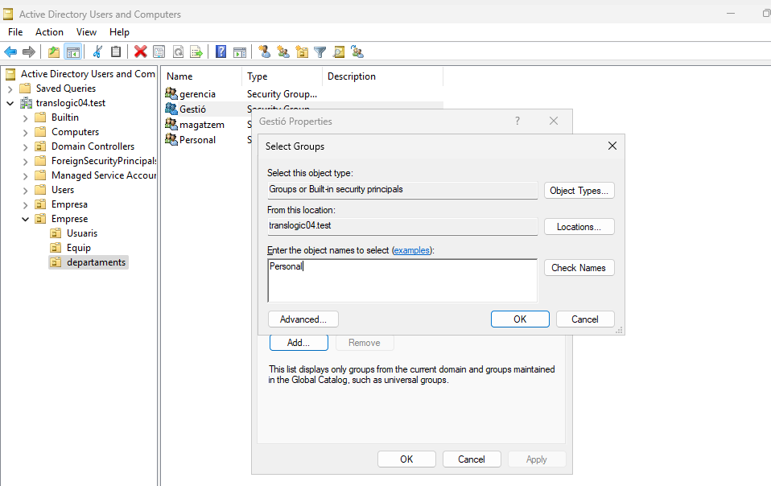

Al de gestio tambe personal. 

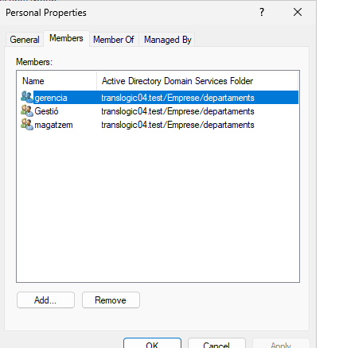

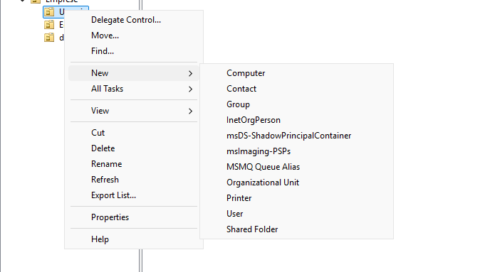

Femclick dret a usuaris fem “new” i user.

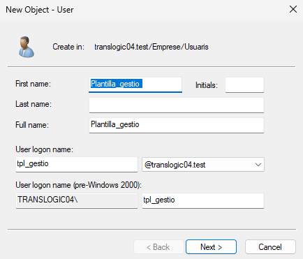

I creem el nm que serà Plantilla_gestio 

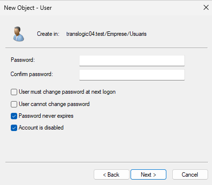

desactivem el password com be ens diu la tasca

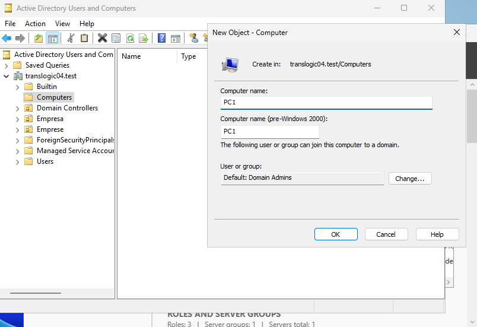

I a computer posem al nom de PC1 li donem a ok i haurem creat un nou computer. 

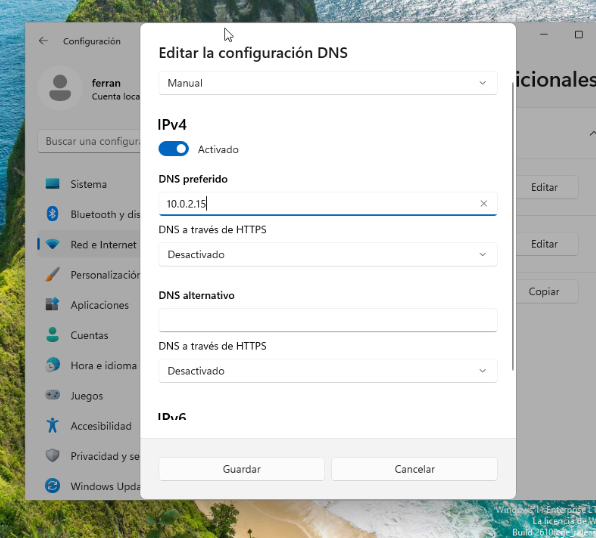

Creem una màquina windows i entrem a la configuració de xarxa i activem IPV4 i posem dns 10.0.2.15

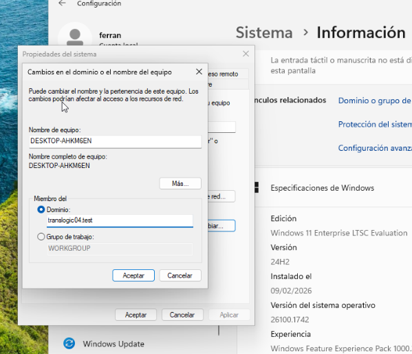

Posem el domini que ens demana que en el meu cas es translogic04.test li donem a acceptar

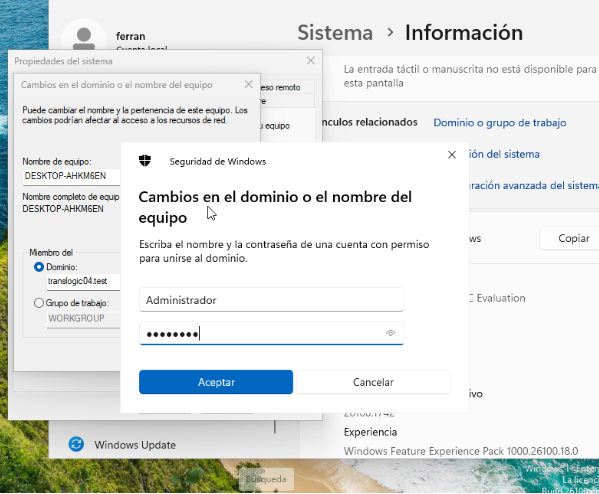

Posem Administrador que es el nom de la altre màquina i la contrasenya tambe de la altre màquina. 

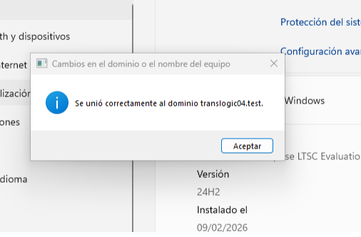

Podem veure com s’ha unit correctament al domini posat anteriorment. 

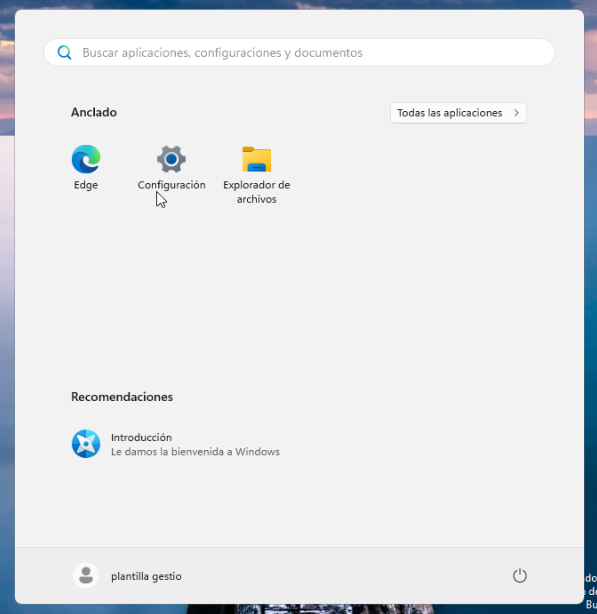

I podem veure com hem entrat amb l’usuari creat Plantilla_gestio a la màquina creada. 

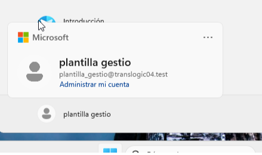

