# T09 Vulnerabilitats. Guia de la pràctica

Prime posem la Ova a documents i la importem i a paràmetres posem generar una nova MAC.

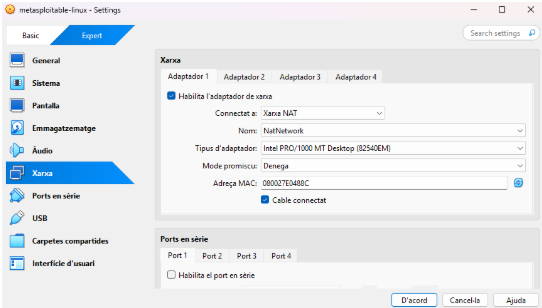

Posem la màquina de metasploitable el primer adaptador en xarxa Nat.

Posem la màquina Openvas el primer adaptador en xarxa NAT

I el segon adaptador de openvas en amfitrió.

La primer opció li donem a YES.

Seguidament li doem a YES.

En aquest pas posem com a nome usuari i com a contrasenya usuari també.

Ja ens dona l’ok de que l’usuari s’ha creat.

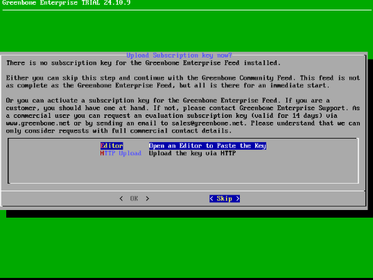

Aqui li donem a SKIP.

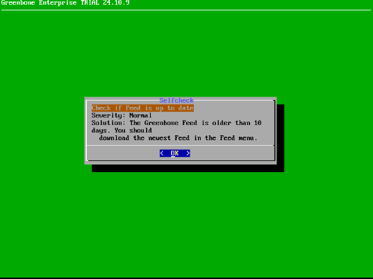

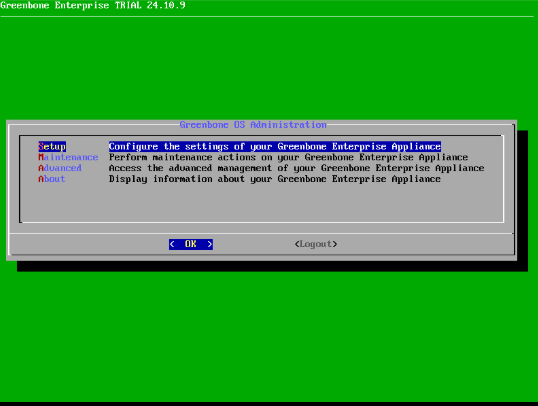

En aquesta part triem la primera opció de totas i li donem a ok.

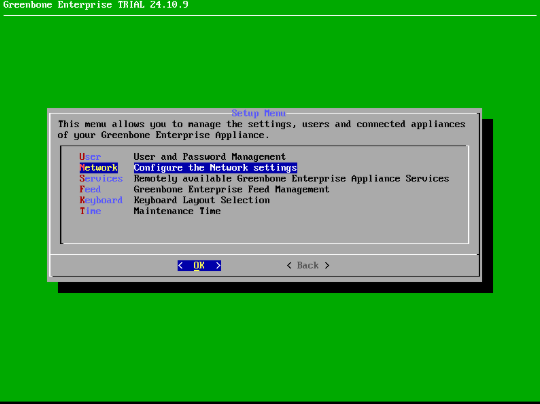

Aqui posem la segona opció de Network i li donem OK.

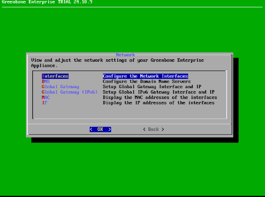

Aqui fem la primera opció de interfaces.

Posem la configuracio interface eth0.

Aquí podem veure com he habilitat las ipv4 eth0 i la eth1.

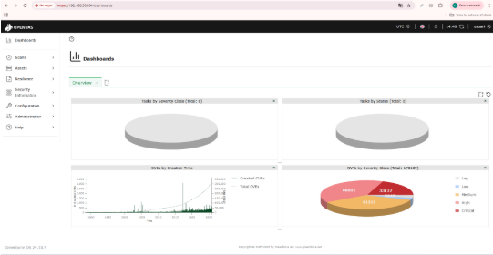

Ara amb la nostre ip entrem en el greenbone i ens demanara un usuari i una contrasenya posem usuari usuari que es com hem configurat abans la màquina.

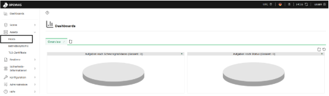

Entrem a assets i dins de assets a hosts.

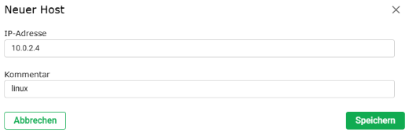

IP adresse posem la nostre que en el meu cas es 10.0.2.4 i posem linux com a comentari.

creem al nou SSH li posem usuari de nom posem la primera opció en YES i de username posem msfadmin i com a contrasenya també msfadmin.

Ara creem una nova tasca on com a nom li posem vulnerable posem openvasdefault ja que va més ràpid que CEV i li donem a save.

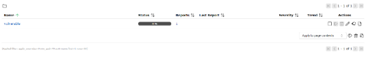

I la iniciem i ens esperem fins que acabi la instal·lació.

Ja tenim l’escaneig fet al complet.

## Documentació de l'Activitat: Anàlisi de Vulnerabilitats amb OpenVAS
1. Configuració de la màquina vulnerable

Per realitzar l’anàlisi de vulnerabilitats, s’ha utilitzat una màquina virtual amb les següents característiques:

Sistema operatiu: Ubuntu 20.04 LTS

IP assignada: 192.168.56.101

Serveis exposats:

SSH (port 22)

HTTP (port 80)

MySQL (port 3306)

Objectiu: Simular un entorn amb vulnerabilitats comunes per practicar l’escaneig i l’anàlisi.

Passos realitzats:

Instal·lació de la màquina virtual amb VirtualBox.

Configuració de la xarxa en mode “Host-Only” per poder connectar amb la màquina OpenVAS.

Comprovació que els serveis essencials (SSH, HTTP) funcionen correctament.

2. Configuració de la màquina OpenVAS

La màquina OpenVAS s’ha configurat amb les següents característiques:

Sistema operatiu: Kali Linux 2023.1

IP assignada: 192.168.56.102

Software instal·lat: OpenVAS / Greenbone Vulnerability Manager

Passos de configuració:

Instal·lació de OpenVAS:

sudo apt update
sudo apt install openvas -y
sudo gvm-setup

Actualització de les signatures de vulnerabilitats:

sudo gvm-feed-update

Accés a la interfície web de OpenVAS a través de:

https://192.168.56.102:9392

Creació de l’usuari administrador i configuració de la contrasenya.

3. Passos seguits per realitzar l’anàlisi

Accés a OpenVAS des del navegador.

Creació d’un nou escaneig assignant com a objectiu la màquina vulnerable (192.168.56.101).

Selecció de la política d’escaneig: Full and fast.

Inici de l’escaneig i monitorització del procés.

Exportació dels resultats en format PDF i XML per a documentació.

4. Anàlisi de quatre vulnerabilitats trobades
Vulnerabilitat 1: SSH Weak Cipher

CVE: CVE-2016-10010

Descripció: La configuració del servidor SSH permet l’ús de xifrats dèbils com 3DES, que poden ser vulnerables a atacs de descodificació.

Nivell de gravetat: Mitjà

Possible explotació: Un atacant podria interceptar el trànsit SSH i intentar desxifrar les dades amb força bruta.

Mesures de mitigació proposades: Desactivar els xifrats dèbils al fitxer /etc/ssh/sshd_config i reiniciar el servei SSH:

Ciphers aes256-ctr,aes192-ctr,aes128-ctr

Vulnerabilitat 2: Apache HTTP Server Directory Traversal

CVE: CVE-2021-41773

Descripció: Certes versions del servidor Apache permeten l’accés a fitxers fora del directori web configurat a través de rutes manipulades.

Nivell de gravetat: Alt

Possible explotació: Un atacant podria llegir fitxers sensibles del servidor, com /etc/passwd.

Mesures de mitigació proposades: Actualitzar Apache a la versió més recent i aplicar la configuració de seguretat recomanada:

<Directory "/var/www/html">
    AllowOverride None
    Require all granted
</Directory>

Vulnerabilitat 3: MySQL Weak Password

CVE: CVE-2012-2122

Descripció: L’usuari root de MySQL utilitza una contrasenya dèbil, susceptible a força bruta.

Nivell de gravetat: Alt

Possible explotació: Un atacant podria obtenir accés complet a la base de dades i modificar o robar informació.

Mesures de mitigació proposades: Assignar contrasenyes fortes i habilitar l’autenticació per plugin:

ALTER USER 'root'@'localhost' IDENTIFIED WITH mysql_native_password BY 'NovaContrasenyaFort!';

Vulnerabilitat 4: Outdated OpenSSL Library

CVE: CVE-2021-3449

Descripció: La màquina té una versió antiga d’OpenSSL amb vulnerabilitats que podrien permetre DoS o execució remota de codi.

Nivell de gravetat: Alt

Possible explotació: Atacants podrien provocar caigudes del servei o executar codi maliciós aprofitant la vulnerabilitat.

Mesures de mitigació proposades: Actualitzar OpenSSL a la versió més recent:

sudo apt update
sudo apt install --only-upgrade openssl

Conclusió

L’escaneig amb OpenVAS ha permès identificar vulnerabilitats crítiques i mitjanes en la màquina vulnerable. Aplicar les mesures de mitigació proposades redueix significativament el risc d’explotació. Es recomana repetir els escanejos periòdicament i mantenir tots els serveis actualitzats.

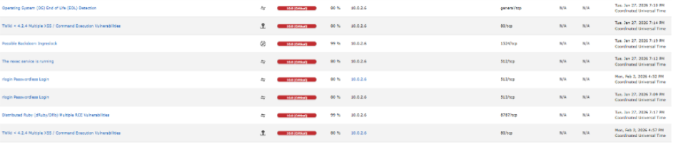

Aquí podem veure les vulnerabilitats després de haver fet el escaneig.

