# T09 Vulnerabilitats. Guia de la pràctica

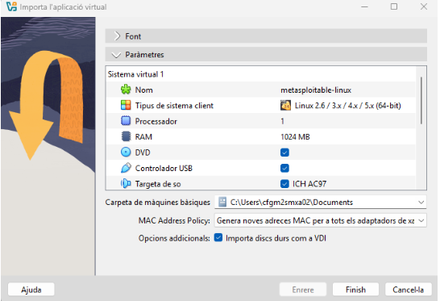

Prime posem la Ova a documents i la importem i a paràmetres posem generar una nova MAC.

Posem la màquina de metasploitable el primer adaptador en xarxa Nat.

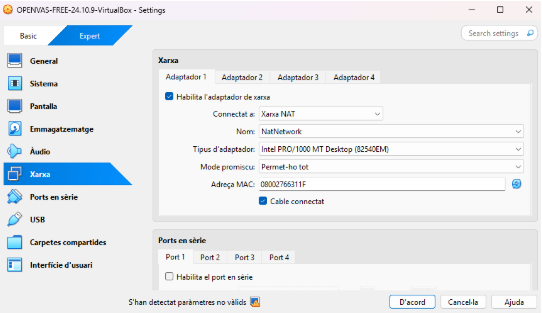

Posem la màquina Openvas el primer adaptador en xarxa NAT

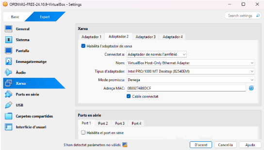

I el segon adaptador de openvas en amfitrió.

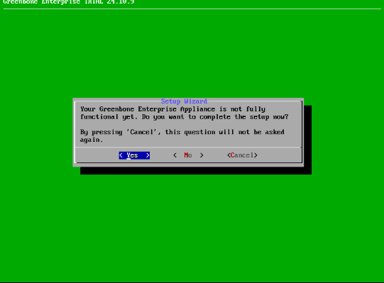

La primer opció li donem a YES.

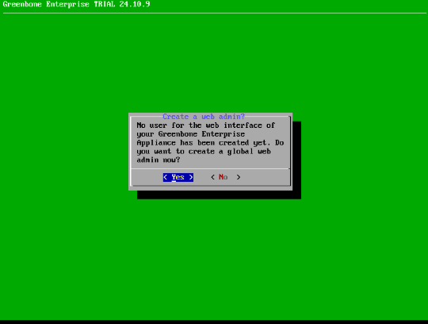

Seguidament li doem a YES.

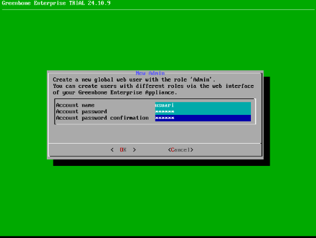

En aquest pas posem com a nome usuari i com a contrasenya usuari també.

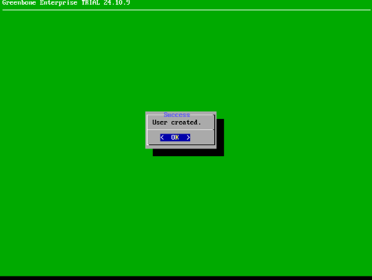

Ja ens dona l’ok de que l’usuari s’ha creat.

Aqui li donem a SKIP.

En aquesta part triem la primera opció de totas i li donem a ok.

Aqui posem la segona opció de Network i li donem OK.

Aqui fem la primera opció de interfaces.

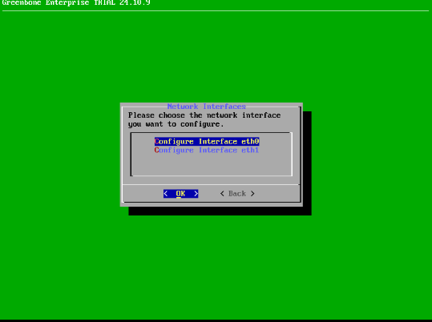

Posem la configuracio interface eth0.

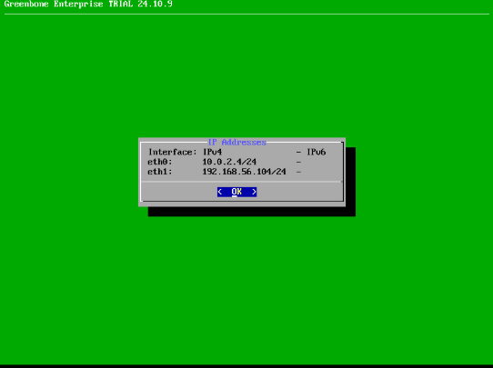

Aquí podem veure com he habilitat las ipv4 eth0 i la eth1.

Ara amb la nostre ip entrem en el greenbone i ens demanara un usuari i una contrasenya posem usuari usuari que es com hem configurat abans la màquina.

Entrem a assets i dins de assets a hosts.

IP adresse posem la nostre que en el meu cas es 10.0.2.4 i posem linux com a comentari.

creem al nou SSH li posem usuari de nom posem la primera opció en YES i de username posem msfadmin i com a contrasenya també msfadmin.

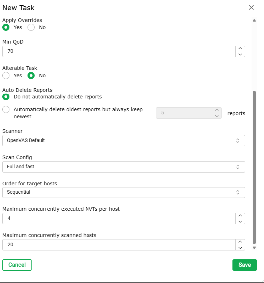

Ara creem una nova tasca on com a nom li posem vulnerable posem openvasdefault ja que va més ràpid que CEV i li donem a save.

I la iniciem i ens esperem fins que acabi la instal·lació.

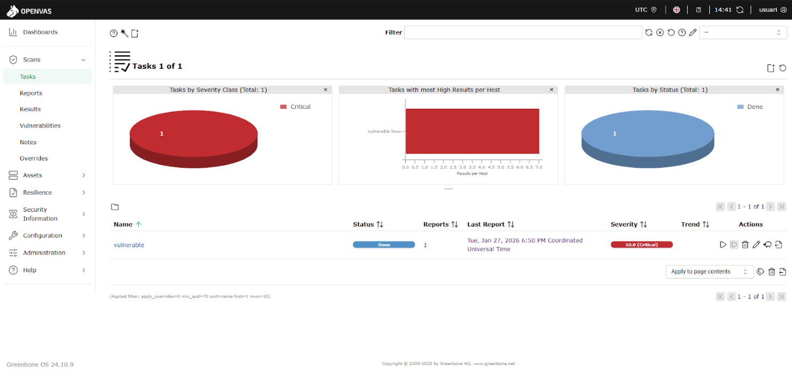

